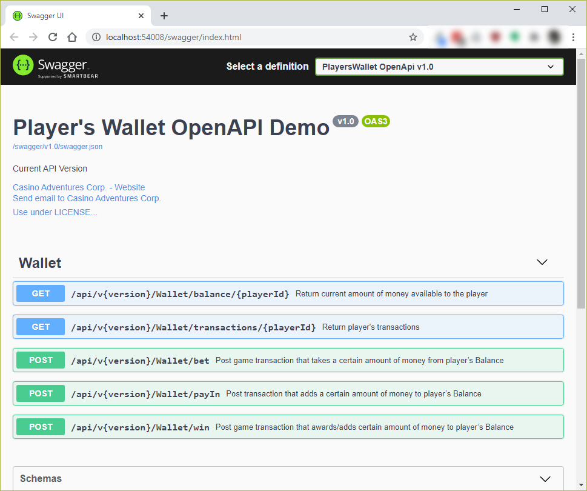
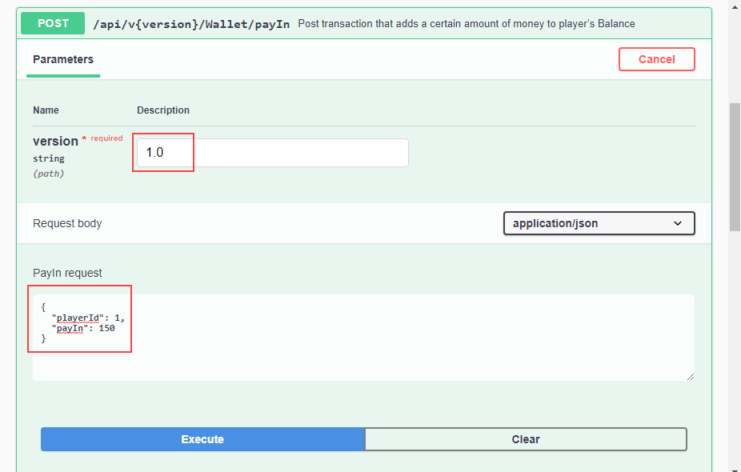
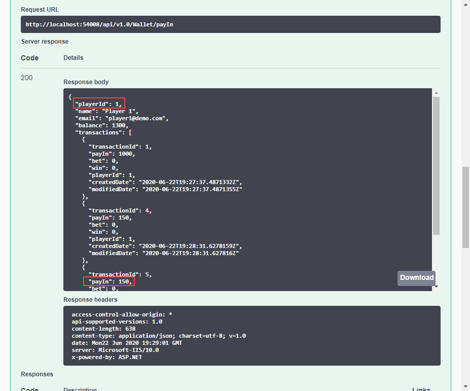

# Player's Wallet OpenAPI Demo

I've made this OpenAPI PoC, which meets the following requirements:
-	Endpoint for Pay in money to players wallet
-	Endpoint to get current Balance for the player
-	Bet and Win endpoints to track game play transactions
-	Endpoint to get all players transactions
-	Responsible gaming feature: for each player should be possible to configure loss limit, so when player reaches that limit BET API method should not be allowed and caller should be notified that limit is reached
-	API documentation
-	Basic validation for API

## API documentation - OpenAPI
[OpenAPI](https://swagger.io/specification/) is a widely used industry standard specification for documenting APIs and the [Swagger](https://swagger.io/) is a set of tools that implement this specification. For .NET, there is the [Swashbuckle.AspNetCore NuGet](https://www.nuget.org/packages/Swashbuckle.AspNetCore/) package that automatically produces a JSON document and an HTML, Javascript and CSS based documentation of your REST API based on the implementation of your controller classes and the data they return. Latest version of Swashbuckle supports ASP.NET Core 3.1 and [OpenAPI 3](https://swagger.io/specification/), which is the latest version of the specification at the time of creating this demo.

Swagger UI looks like this...



Pay-in money example:



Result ...



## Existing Players
** Since this is a demo version, all data are stored in memory. Existing players are:
```json
[
  {
    "playerId": 1,
    "name": "Player 1",
    "email": "player1@demo.com",
    "balance": 1000,
    "transactions": [
      {
        "transactionId": 1,
        "payIn": 1000,
        "bet": 0,
        "win": 0,
        "playerId": 1,
        "createdDate": "2020-06-22T14:52:03.3912991Z",
        "modifiedDate": "2020-06-22T14:52:03.3913018Z"
      }
    ],
    "createdDate": "2020-06-22T14:52:03.3911205Z",
    "modifiedDate": "2020-06-22T14:52:03.3912079Z"
  },
  {
    "playerId": 2,
    "name": "Player 2",
    "email": "player2@demo.com",
    "balance": 2000,
    "transactions": [
      {
        "transactionId": 2,
        "payIn": 2000,
        "bet": 0,
        "win": 0,
        "playerId": 2,
        "createdDate": "2020-06-22T14:52:03.3913036Z",
        "modifiedDate": "2020-06-22T14:52:03.3913036Z"
      }
    ],
    "createdDate": "2020-06-22T14:52:03.3912898Z",
    "modifiedDate": "2020-06-22T14:52:03.3912967Z"
  },
  {
    "playerId": 3,
    "name": "Player 3",
    "email": "player3@demo.com",
    "balance": 3000,
    "transactions": [
      {
        "transactionId": 3,
        "payIn": 3000,
        "bet": 0,
        "win": 0,
        "playerId": 3,
        "createdDate": "2020-06-22T14:52:03.391304Z",
        "modifiedDate": "2020-06-22T14:52:03.3913041Z"
      }
    ],
    "createdDate": "2020-06-22T14:52:03.3912986Z",
    "modifiedDate": "2020-06-22T14:52:03.3912987Z"
  }
]
```

PoC demonstrate also the following functionalities/technologies:
- OpenAPI Versioning
- Global Error Handling
- Logging with [Serilog](https://serilog.net/) (sink to file)
- Asynchronous repository Pattern for Entity types
- [Fluent Validation](https://fluentvalidation.net/)
- [EF Core InMemory Database Provider](https://www.nuget.org/packages/Microsoft.EntityFrameworkCore.InMemory)
- Integration and Unit Tests

## Prerequisites
- [Visual Studio](https://www.visualstudio.com/vs/community) 2019 16.4.5 or greater
- [.NET Core SDK 3.1](https://dotnet.microsoft.com/download/dotnet-core/3.1)

## Tags & Technologies
- [ASP.NET Core 3.1](https://docs.microsoft.com/en-us/aspnet/?view=aspnetcore-3.1#pivot=core)
- [Entity Framework Core 3.1](https://docs.microsoft.com/en-us/ef/core/)
- [OpenAPI](https://swagger.io/specification/)
- [Serilog](https://serilog.net/)
- [Fluent Validation](https://fluentvalidation.net/)

Enjoy!

## Licence
Licenced under [MIT](http://opensource.org/licenses/mit-license.php).
Contact me on [LinkedIn](https://si.linkedin.com/in/matjazbravc).
